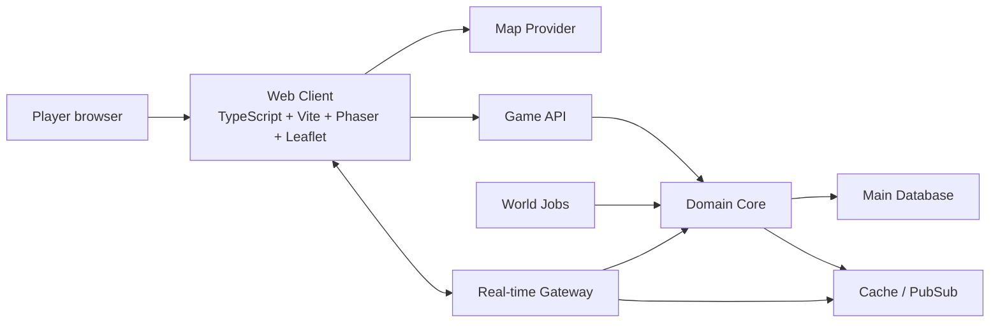
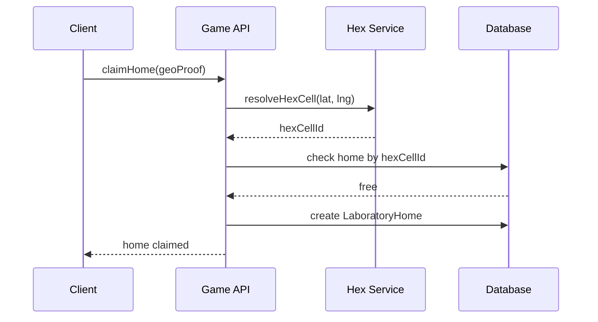
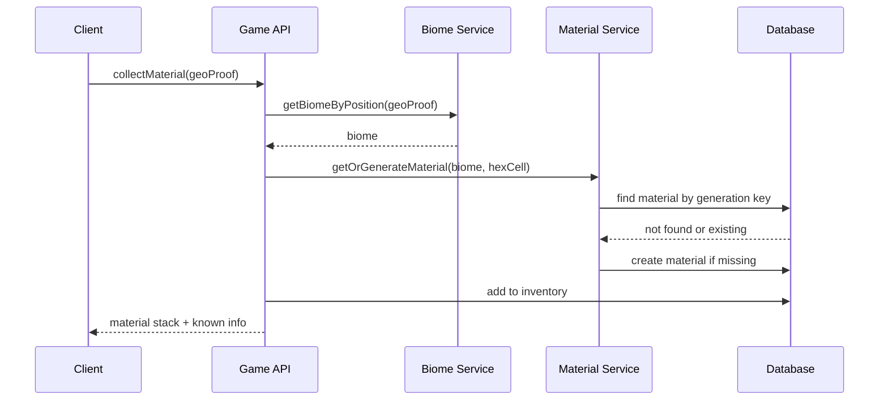
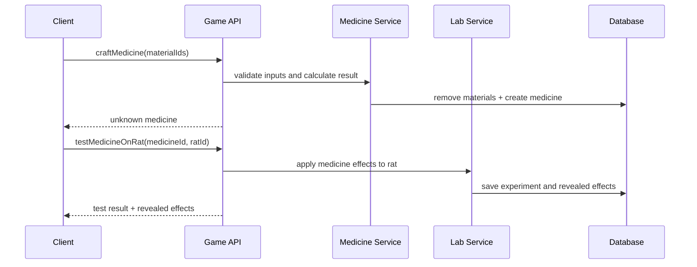
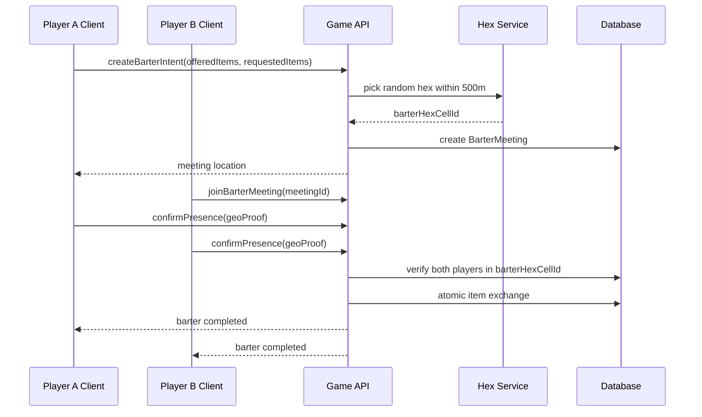

# Архитектура проекта: Scientists World

## 1. Назначение документа

Документ описывает целевую архитектуру Scientists World: web-игры с реальной картой, геопозицией, hex-сеткой 50 м, процедурными биомами, домами-лабораториями, материалами, лекарствами, тестами на крысах, событиями, бартером и рейтингом выживания.

Документ не фиксирует окончательный backend-стек, БД и real-time transport. Но MVP проектируется сразу как backend-backed игра, а не как offline-прототип.

## 2. Архитектурный принцип

Игра должна быть разделена на три слоя:

1. `Client` — карта, UI, local rendering, ввод игрока.
2. `Game Backend` — правила игры, проверка действий, real-time, persistence.
3. `Game Data` — долговременное хранение игроков, домов, hex-ячеек, материалов, лекарств, событий и рейтинга.

Критичное правило: клиент не должен быть источником истины для прогресса, геопозиции, крафта, генерации материалов, рейтинга и обменов.

## 3. Принятые архитектурные решения

| Вопрос | Решение |
|---|---|
| MVP | Сразу backend-backed MVP |
| География | Сразу весь мир, без ограничения Туркменистаном |
| Hex-grid | Использовать готовую geo-index библиотеку типа `H3` |
| Debug mode | Добавить режим клика по карте для разработки и тестирования |
| Дом-лаборатория | Можно переносить; мировые и локальные события могут обнулять дома |
| Смерть игрока | Обнуляет survival-run, инвентарь и лекарства |
| Знание свойств материалов | Персональное для каждого игрока |
| Бартер | Физический обмен в случайной hex-ячейке в радиусе 500 м |
| Условие обмена | Оба игрока должны присутствовать в barter-ячейке |
| Видимость домов | Дома других игроков видны только в радиусе 1000 м от текущего игрока |

## 4. Общая схема



## 5. Client architecture

Текущий client остается web-приложением на `TypeScript`, `Vite`, `Phaser` и `Leaflet`.

Ответственность client:

| Зона | Ответственность |
|---|---|
| Map UI | Отображение реальной карты и игровых слоев |
| Hex overlay | Рендер hex-ячеек 50 м |
| Player location | Получение координат через Browser Geolocation API |
| Debug location | Тестовый режим выбора позиции кликом по карте |
| Laboratory UI | Крафт лекарств, тесты на крысах, журнал экспериментов |
| Inventory UI | Материалы, лекарства, известные свойства |
| Barter UI | Просмотр и создание barter-offer |
| Event UI | Отображение активных событий и эффектов |

Client может рассчитывать preview-данные, но финальное действие должно подтверждаться backend.

Примеры действий, которые требуют backend-подтверждения:

1. `claimHome`
2. `collectMaterial`
3. `craftMedicine`
4. `testMedicineOnRat`
5. `applyMedicine`
6. `createBarterOffer`
7. `acceptBarterOffer`

Debug-режим должен быть явно отделен от production-режима. Действия, выполненные через debug-click, не должны попадать в публичный рейтинг, экономику и production-прогресс.

## 6. Domain core

`Domain Core` — центральный слой игровой логики. Его нужно держать максимально независимым от Phaser, Leaflet, DOM и конкретной БД.

Предлагаемая структура:

```text
src/
  core/
    geo/
      HexGrid.ts
      GeoPosition.ts
      GeoDistance.ts
    player/
      Player.ts
      PlayerState.ts
      SurvivalRun.ts
    home/
      LaboratoryHome.ts
      HomeClaimService.ts
    biome/
      Biome.ts
      BiomeGenerator.ts
      BiomeService.ts
    materials/
      Material.ts
      MaterialGenerator.ts
      MaterialTraitCatalog.ts
      MaterialDiscoveryService.ts
    medicine/
      Medicine.ts
      MedicineCraftingService.ts
      MedicineEffectResolver.ts
    lab/
      LabRat.ts
      RatStateService.ts
      ExperimentService.ts
    events/
      GameEvent.ts
      EventResolver.ts
    economy/
      BarterOffer.ts
      BarterService.ts
    rating/
      SurvivalRatingService.ts
```

## 7. Backend architecture

Целевой backend нужен не для MVP-витрины, а для честной multiplayer-игры.

Ответственность backend:

| Модуль | Ответственность |
|---|---|
| Auth | Игрок, сессия, устройство |
| Geo Validation | Проверка координат и допустимости действия |
| Hex Service | Перевод координат в hex-cell |
| Home Service | Claim, перенос и обнуление дома-лаборатории |
| Biome Service | Генерация и чтение биомов |
| Material Service | Генерация и фиксация материалов |
| Medicine Service | Крафт, эффекты, стабильность |
| Lab Service | Крысы, тесты, раскрытие эффектов |
| Event Service | Глобальные, региональные, локальные события |
| Inventory Service | Материалы и лекарства игрока |
| Barter Service | Физический обмен в случайной hex-ячейке |
| Rating Service | Top-100 по survival-run |
| Realtime Service | Nearby-карта домов, события, barter-встречи |

## 8. Hex-grid

Hex-grid является базовой координатной моделью игры.

Требования:

1. Размер hex-ячейки — 50 метров в диаметре.
2. Координаты игрока должны стабильно переводиться в `hexCellId`.
3. `hexCellId` должен быть одинаковым на client и backend.
4. Биомы, дома, события и материалы должны ссылаться на `hexCellId`.
5. Хранить все hex-ячейки мира заранее нельзя; ячейки нужно создавать лениво при первом обращении.

```ts
interface HexCell {
  id: string;
  q: number;
  r: number;
  centerLat: number;
  centerLng: number;
  diameterMeters: 50;
}
```

Принятое решение: использовать готовую geo-index библиотеку типа `H3`, чтобы не писать собственную геометрическую модель мира с нуля.

Важно: размер ячейки в `H3` выбирается через resolution, поэтому точные 50 метров могут быть приближением. В архитектуре нужно зафиксировать целевой игровой диаметр 50 м и подобрать ближайший resolution или дополнительную игровую нормализацию поверх `H3`.

## 9. Procedural generation

Процедурная генерация должна быть воспроизводимой и фиксируемой.

Разница между типами генерации:

| Тип | Правило |
|---|---|
| Biome generation | Может быть deterministic по `hexCellId + worldSeed` |
| Material generation | Генерируется один раз и навсегда сохраняется |
| Medicine generation | Генерируется при крафте и сохраняется как созданный объект |
| Event generation | Создается системой событий и имеет срок действия |

Материал нельзя пересчитывать каждый раз только по seed, если по правилам он должен быть навсегда зафиксирован. Seed можно хранить для аудита и повторяемости, но source of truth — запись в БД.

## 10. Data model

Минимальные агрегаты:

| Aggregate | Ключ | Назначение |
|---|---|---|
| `Player` | `playerId` | Аккаунт ученого |
| `PlayerState` | `playerId` | Состояния, эффекты, жизнь |
| `SurvivalRun` | `runId` | Попытка выживания |
| `LaboratoryHome` | `homeId` | Дом-лаборатория в hex |
| `HexCell` | `hexCellId` | Игровая ячейка |
| `Biome` | `biomeId` | Группа 3-6 hex-ячеек |
| `Material` | `materialId` | Зафиксированный материал |
| `Medicine` | `medicineId` | Созданное лекарство |
| `LabRat` | `ratId` | Крыса для тестов |
| `Experiment` | `experimentId` | Результат теста |
| `GameEvent` | `eventId` | Событие мира |
| `Inventory` | `playerId` | Предметы игрока |
| `BarterOffer` | `offerId` | Бартерное предложение |
| `BarterMeeting` | `meetingId` | Случайная hex-ячейка физического обмена |
| `KnowledgeProfile` | `playerId + materialId` | Персонально открытые свойства материала |

## 11. Persistence

Для реальной игры нужны долговременное хранилище и транзакции.

Критичные операции:

| Операция | Почему нужна транзакция |
|---|---|
| Claim home | Нельзя занять одну hex-ячейку двумя игроками |
| Generate material | Нельзя создать две разные версии одного материала |
| Craft medicine | Нужно атомарно списать материалы и создать лекарство |
| Barter accept | Нужно атомарно обменять предметы двух игроков |
| Death / survival-run end | Нужно завершить run и очистить инвентарь/лекарства |
| Home reset by event | Нужно снять владение с hex-ячеек, затронутых событием |

MVP сразу использует backend persistence. `localStorage` допускается только для UI cache, настроек клиента и временного debug-состояния.

## 12. Real-time

Real-time нужен не для всего подряд, а для ограниченного набора данных.

| Поток | Транспорт |
|---|---|
| Nearby home map updates | WebSocket или polling |
| Local events | WebSocket или server polling |
| Barter meeting updates | WebSocket или polling |
| Top-100 rating | Polling |
| Own state updates | API response + periodic sync |

Дома игроков видны только в радиусе 1000 метров от текущего игрока. Позиции игроков не транслируются всем по умолчанию.

## 13. Geo validation и anti-cheat

Browser Geolocation API нельзя считать полностью доверенным источником.

Минимальные проверки:

1. Проверять скорость перемещения между действиями.
2. Проверять timestamp координат.
3. Проверять точность `accuracy`.
4. Ограничивать частоту сбора материалов.
5. Привязывать сбор к текущей `hexCellId`.
6. Логировать подозрительные перемещения.

```ts
interface GeoProof {
  lat: number;
  lng: number;
  accuracyMeters: number;
  capturedAt: string;
}
```

Полной защиты от fake GPS в браузере нет. Архитектура должна снижать выгоду от подмены, а не обещать абсолютную защиту.

## 14. Основные сценарии

### 14.1 Claim home



### 14.2 Collect material



### 14.3 Craft medicine and test on rat



### 14.4 Physical barter meeting



Правило обмена: оба игрока должны физически присутствовать в назначенной случайной hex-ячейке в радиусе 500 метров от инициатора или согласованной точки встречи.

## 15. API boundary

Предварительные API endpoints:

| Method | Endpoint | Назначение |
|---|---|---|
| `POST` | `/api/auth/session` | Создать или обновить игровую сессию |
| `POST` | `/api/geo/resolve-hex` | Получить hex по координатам |
| `POST` | `/api/home/claim` | Занять дом-лабораторию |
| `GET` | `/api/map/layers` | Получить игровые слои карты |
| `POST` | `/api/materials/collect` | Собрать материал |
| `GET` | `/api/inventory` | Получить инвентарь |
| `POST` | `/api/medicine/craft` | Создать лекарство |
| `POST` | `/api/lab/test-rat` | Проверить лекарство на крысе |
| `POST` | `/api/medicine/apply` | Применить лекарство к игроку |
| `GET` | `/api/events/active` | Активные события |
| `POST` | `/api/barter/meetings` | Создать физическую barter-встречу |
| `GET` | `/api/barter/meetings/nearby` | Найти barter-встречи рядом |
| `POST` | `/api/barter/meetings/:id/join` | Присоединиться к barter-встрече |
| `POST` | `/api/barter/meetings/:id/confirm-presence` | Подтвердить присутствие в hex-ячейке |
| `POST` | `/api/barter/meetings/:id/complete` | Завершить обмен |
| `GET` | `/api/rating/top100` | Рейтинг выживания |

## 16. MVP architecture

Первый MVP делается сразу с backend.

Минимальный состав:

1. Web client с картой мира.
2. Backend API для всех игровых действий.
3. Geo-index сервис на готовой библиотеке типа `H3`.
4. БД для игроков, домов, материалов, лекарств, крыс, экспериментов и survival-run.
5. Debug-click режим для разработки.
6. Production GPS режим для настоящего прогресса.

Client-only логика допустима только как preview UI. Источник истины с первого MVP — backend.

## 17. Текущие расхождения с кодом

| Текущий код | Нужно изменить |
|---|---|
| `HomeSystem.radius = 100` | Дом должен быть hex-ячейкой 50 м |
| `CraftingSystem.craft(item1, item2)` | Лекарство создается из 3+ материалов |
| `BiomeGenerator.generateBiomes(...)` | Биом должен быть группой 3-6 hex-ячеек |
| `Player.inventory: any[]` | Нужны отдельные stacks для материалов и лекарств |
| `MapScene` без реальной Leaflet-карты | Нужно добавить карту, слои и геопозицию |
| Нет backend boundary | Нужно отделить client preview от server-confirmed actions |

## 18. Оставшиеся уточняющие вопросы

| Вопрос | Почему важно |
|---|---|
| Какой backend-стек выбрать? | Нужны API, real-time, транзакции, jobs и деплой |
| Какую БД выбрать для геоданных и транзакций? | Нужны hex-запросы, inventory, barter и rating |
| Какой уровень `H3` использовать для игрового диаметра 50 м? | У `H3` resolution не обязан совпадать ровно с 50 м |
| Какой способ авторизации использовать в MVP? | Нужно связать игрока, дом, инвентарь и survival-run |
| Сколько стоит перенос дома-лаборатории? | Влияет на баланс и ценность географии |
| Какие события могут обнулять дома? | Нужно формализовать риск потери лаборатории |
| Что именно сохраняется после смерти кроме дома? | Сейчас зафиксирована потеря run, inventory и medicines, но нужен список исключений |
| Как игрок получает новых крыс для тестов? | Влияет на темп исследований и монетизацию/баланс |
| Сколько свойств лекарства раскрывает один тест на крысе? | Влияет на глубину исследования |
| Как долго существует barter meeting? | Нужно для UX, экономики и очистки старых встреч |
